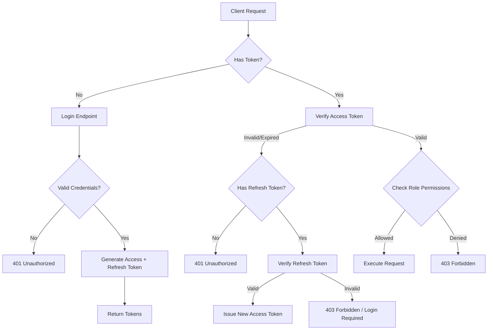

# Authentication & Access Control Design

## 1. User Role Behavior Summary

### Roles
The system implements a strict Role-Based Access Control (RBAC) with two hierarchical roles.

1.  **Admin**
    *   **Description**: Superuser with complete control over the system.
    *   **Permissions**:
        *   User Management: Create, update, delete, lock/unlock users.
        *   Inventory Management: Create items, locations, perform adjustments.
        *   Reporting: View system-wide logs, financial reports, audit trails.
        *   System: Configure settings, view health metrics.
    *   **Restrictions**: Cannot delete the last remaining admin account.

2.  **User**
    *   **Description**: Operational staff responsible for day-to-day inventory tasks.
    *   **Permissions**:
        *   Inventory: View items, view stock levels.
        *   Movements: Record receipts, consumption, and transfers.
        *   Profile: Update own password/profile.
    *   **Restrictions**:
        *   Cannot create/delete items or locations.
        *   Cannot perform "Adjustment" type movements (requires approval/admin).
        *   Cannot view user management or system settings.

### Auth Flowchart

### Exception Handling
*   **Missing Token**: Return `401 Unauthorized` with message "Authentication token required".
*   **Expired Token**: Return `401 Unauthorized` with error code `TOKEN_EXPIRED`. Client should attempt refresh.
*   **Invalid Token**: Return `401 Unauthorized` with message "Invalid token".
*   **Insufficient Permissions**: Return `403 Forbidden` with message "Insufficient permissions for this resource".
*   **Account Locked**: Return `403 Forbidden` with message "Account is locked due to excessive failed attempts".

## 2. Security Specifications

### Token Management
*   **Access Token**: Short-lived (e.g., 15 minutes), Signed JWT. Contains `sub` (user_id), `role`, `email`.
*   **Refresh Token**: Long-lived (e.g., 7 days), stored in DB (hashed). Used to obtain new access tokens. Revoked on logout or security breach.

### Password Security
*   **Algorithm**: bcrypt (work factor 12).
*   **Policy**: Min 8 chars, 1 uppercase, 1 lowercase, 1 number, 1 special char.

### Rate Limiting
*   **Login**: Max 5 failed attempts per 15 minutes. Account locked temporarily after limit.
*   **API**: Max 100 requests per minute per IP.

### CSRF Protection
*   For cookie-based auth: SameSite=Strict cookies + Double Submit Cookie or CSRF Token in header.
*   For header-based auth (Bearer): Standard CORS policies apply.

## 3. Implementation Details

The authentication system is implemented in `auth/` directory with framework-agnostic logic.
- `auth/core.js`: Cryptographic primitives and token management.
- `auth/middleware.js`: Request interception and validation.
- `auth/login.js`: Sample route handler.
