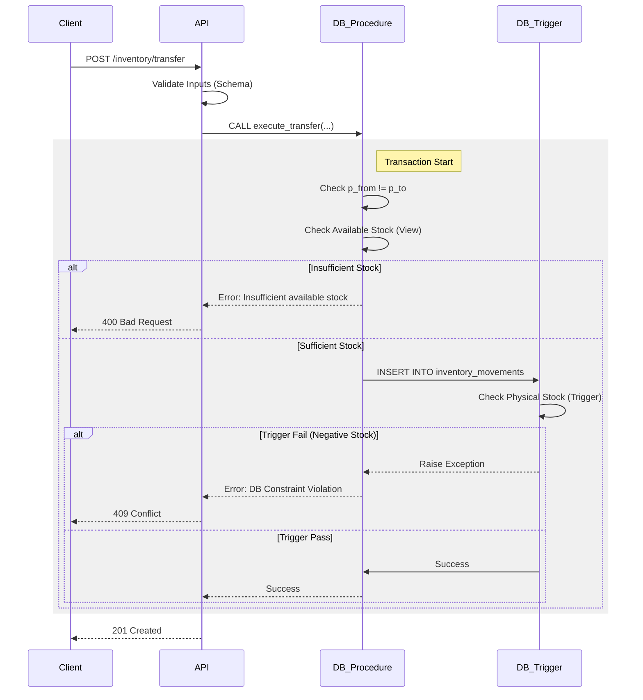

# Inventory API Design & Specification

## 1. Overview
This API manages inventory operations including Stock In (Receipts), Stock Out (Consumption/Adjustments), and Transfers. It ensures strict data integrity via database transactions and validation rules.

## 2. Validation & Business Logic

### General Rules
*   **Quantity**: Must be a positive integer (> 0).
*   **Entities**: referenced `item_id` and `location_id` must exist.
*   **User**: `user_id` is derived from the authentication token.

### Stock In (Receipt)
*   **Logic**: Adds inventory to a specific location.
*   **Validation**: Standard input validation.
*   **DB Operation**: Insert into `inventory_movements` with `from_location_id = NULL`.

### Stock Out (Consumption)
*   **Logic**: Removes inventory from a location.
*   **Validation**:
    *   **Availability**: Checks `available_inventory` (Physical Stock - Reservations).
    *   **Constraint**: Cannot result in negative physical stock (enforced by DB Trigger).
*   **DB Operation**: Insert into `inventory_movements` with `to_location_id = NULL`.

### Transfer
*   **Logic**: Moves inventory between two valid locations.
*   **Validation**:
    *   **Distinct Locations**: Source and Destination must be different.
    *   **Availability**: Source must have sufficient `available_inventory`.
*   **Atomicity**: Handled via a single database transaction (Stored Procedure `execute_transfer`).

## 3. Transaction Flow Diagram (Transfer)



## 4. OpenAPI Specification

```yaml
openapi: 3.0.0
info:
  title: Inventory Movement API
  version: 1.0.0
paths:
  /inventory/stock-in:
    post:
      summary: Add stock to a location (Receipt)
      requestBody:
        required: true
        content:
          application/json:
            schema:
              type: object
              required: [item_id, quantity, location_id]
              properties:
                item_id: { type: integer }
                quantity: { type: integer, minimum: 1 }
                location_id: { type: integer }
                reference_number: { type: string }
                notes: { type: string }
      responses:
        201:
          description: Stock received successfully
        400:
          description: Validation error
        404:
          description: Item or Location not found

  /inventory/stock-out:
    post:
      summary: Remove stock from a location (Consumption)
      requestBody:
        required: true
        content:
          application/json:
            schema:
              type: object
              required: [item_id, quantity, location_id, reason_code]
              properties:
                item_id: { type: integer }
                quantity: { type: integer, minimum: 1 }
                location_id: { type: integer }
                reason_code: { type: string }
                reference_number: { type: string }
      responses:
        201:
          description: Stock removed successfully
        400:
          description: Validation error or Insufficient stock

  /inventory/transfer:
    post:
      summary: Move stock between locations
      requestBody:
        required: true
        content:
          application/json:
            schema:
              type: object
              required: [item_id, quantity, from_location_id, to_location_id]
              properties:
                item_id: { type: integer }
                quantity: { type: integer, minimum: 1 }
                from_location_id: { type: integer }
                to_location_id: { type: integer }
                transfer_reason: { type: string }
      responses:
        201:
          description: Transfer completed successfully
        400:
          description: Validation error or Insufficient stock
```

## 5. Performance Considerations
*   **Indexing**: `inventory_movements` is heavily indexed on `item_id`, `location_id`, and `created_at`.
*   **Calculations**: Real-time stock calculation sums movements. For high volume, a `materialized_view` or a cached snapshot table (updated via triggers) is recommended to avoid full table scans on read.
*   **Concurrency**: The database trigger locks rows appropriately to prevent race conditions during simultaneous movements for the same item/location.

