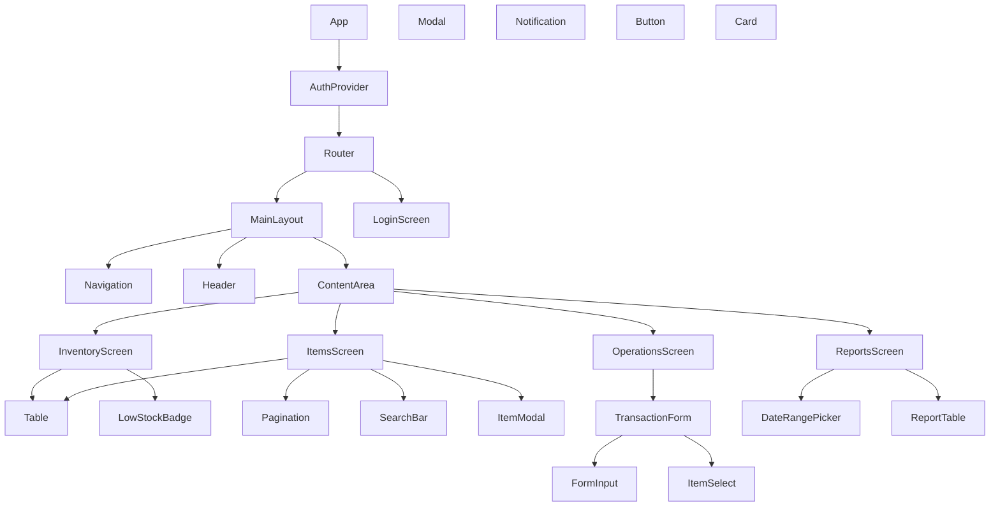
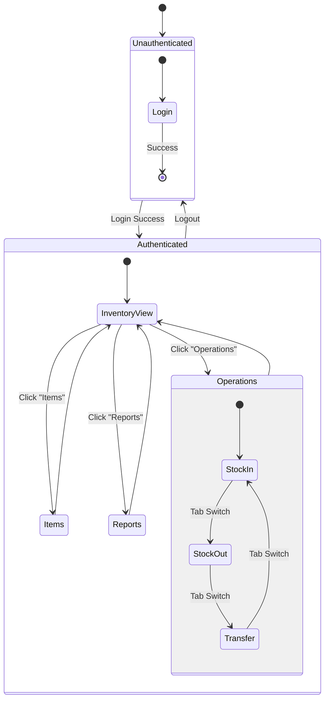

# Inventory Quick - UI Design Specification

## 1. Page List & Descriptions

### 1.1 Login Screen
*   **Route:** `/login`
*   **Purpose:** Entry point for unauthenticated users.
*   **Features:**
    *   Username and Password input fields.
    *   "Remember Me" checkbox.
    *   "Forgot Password" link (mockup/placeholder).
    *   Form validation (empty fields, minimum length).
    *   Redirects to Inventory View upon success.

### 1.2 Inventory View (Dashboard)
*   **Route:** `/inventory` (Default authenticated route)
*   **Purpose:** Overview of current stock levels.
*   **Features:**
    *   Sortable table displaying items (SKU, Name, Category, Location, Quantity, Unit).
    *   **Location Filter:** Dropdown to filter by 'Main Warehouse', 'Secondary Storage', etc.
    *   **Low Stock Indicators:** Rows highlight or show an icon when quantity < threshold.
    *   **Export CSV:** Button to trigger the CSV export (integrating with the backend logic).
    *   **Navigation:** Links to Stock In/Out/Transfer forms.

### 1.3 Item Management
*   **Route:** `/items`
*   **Purpose:** CRUD operations for the product catalog.
*   **Features:**
    *   Data Table: List of all items with columns for SKU, Name, Description, Category, Type, Status.
    *   **Search/Filter:** Text input to search by name/SKU; Dropdown for Category.
    *   **Add New Item:** Modal or separate page to create items.
    *   **Edit/Delete:** Actions per row.
    *   **Pagination:** Controls for navigating large datasets.

### 1.4 Inventory Operations
*   **Route:** `/operations` (or sub-routes `/operations/in`, `/operations/out`, `/operations/transfer`)
*   **Purpose:** Execute stock movements.
*   **Sub-screens:**
    *   **Stock In:** Form for Receipts (Supplier -> Location).
    *   **Stock Out:** Form for Consumption/Sales (Location -> External).
    *   **Transfer:** Form for moving stock between locations (Location A -> Location B).
*   **Common Features:**
    *   Item Selection (Dropdown/Search).
    *   Quantity Input (with validation > 0).
    *   Date Picker.
    *   Reference Number / Notes fields.

### 1.5 Reports
*   **Route:** `/reports`
*   **Purpose:** View historical data and summaries.
*   **Features:**
    *   **Date Range Selector:** Start and End date pickers.
    *   **Report Type Selector:** Monthly Summary, Weekly Snapshot, Movement History.
    *   **Data View:** Simple tabular display of the selected report.
    *   **Print Button:** CSS styled print-friendly layout.

---

## 2. Component Hierarchy



### Component Structure
*   **Core**
    *   `App.js`: Root component, providers.
    *   `AuthProvider.js`: Context for user state (token, user info).
    *   `MainLayout.js`: Wrapper for authenticated routes (Sidebar/Navbar).
    *   `PrivateRoute.js`: HOC/Component for route protection.
*   **Shared**
    *   `Table.js`: Reusable table with `data`, `columns`, `onSort` props.
    *   `Button.js`: Standardized buttons (primary, secondary, danger).
    *   `Input.js`: Labelled inputs with error display.
    *   `Modal.js`: Portal-based overlay.
    *   `Notification.js`: Toast messages for success/error feedback.
*   **Screens**
    *   `Login/`: Login logic and view.
    *   `Inventory/`: Dashboard view.
    *   `Items/`: Item management logic.
    *   `Operations/`: Tabs or sub-pages for In/Out/Transfer.
    *   `Reports/`: Reporting UI.

---

## 3. Navigation State Machine



---

## 4. Wireframes

### 4.1 Login Screen
```text
+-----------------------------------------------+
|                                               |
|           [ LOGO: Inventory Quick ]           |
|                                               |
|        +-----------------------------+        |
|        |  Username: [_____________]  |        |
|        |                             |        |
|        |  Password: [_____________]  |        |
|        |                             |        |
|        |  [x] Remember me            |        |
|        |                             |        |
|        |       [  LOGIN BUTTON  ]    |        |
|        |                             |        |
|        |      Forgot Password?       |        |
|        +-----------------------------+        |
|                                               |
+-----------------------------------------------+
```

### 4.2 Inventory View (Main)
```text
+-------------------------------------------------------+
| [Menu] Inventory Quick                      [Logout]  |
+----------------------+--------------------------------+
|  Nav:                |  Dashboard                     |
| > Inventory          |                                |
|   Items              |  Filter: [ All Locations v ]   |
|   Operations         |  [ Export CSV ]                |
|   Reports            |                                |
|                      |  +--------------------------+  |
|                      |  | SKU | Name | Qty | Loc   |  |
|                      |  |-----|------|-----|-------|  |
|                      |  | 001 | Flour| 100 | Main  |  |
|                      |  | 002 | Sugar| 10  | Sec   |  |
|                      |  | 003 | Salt | 2   | Main  |  |
|                      |  +--------------------------+  |
|                      |  < Prev  1  2  3  Next >       |
+----------------------+--------------------------------+
```

### 4.3 Operations (Stock In/Out/Transfer)
```text
+-------------------------------------------------------+
| ... (Nav)            |  Operations                    |
+----------------------+--------------------------------+
|                      |  [ Stock In ] [ Stock Out ] [ Transfer ] |
|                      |                                          |
|                      |  ** Stock In **                          |
|                      |                                          |
|                      |  Item:     [ Search/Select Item v ]      |
|                      |  Quantity: [ 0                ]          |
|                      |  To Loc:   [ Main Warehouse     v ]      |
|                      |  Date:     [ 2023-10-27         ]      |
|                      |  Ref #:    [ PO-12345           ]      |
|                      |  Notes:    [ __________________ ]        |
|                      |                                          |
|                      |           [ SUBMIT TRANSACTION ]         |
+----------------------+--------------------------------+
```

---

## 5. Style Guide

Since this is a "Pure React" implementation without external libraries, we will use CSS Modules or styled-components (simulated with standard CSS) with a defined variable set.

### 5.1 Color Palette
*   **Primary:** `#2563EB` (Blue-600) - Actions, Links, Active States.
*   **Secondary:** `#475569` (Slate-600) - Navigation, Secondary Text.
*   **Success:** `#16A34A` (Green-600) - Success Messages, Stock In.
*   **Danger:** `#DC2626` (Red-600) - Errors, Delete Actions, Low Stock (< 10).
*   **Warning:** `#D97706` (Amber-600) - Medium Stock.
*   **Background:** `#F8FAFC` (Slate-50) - App Background.
*   **Surface:** `#FFFFFF` (White) - Cards, Modals, Tables.

### 5.2 Typography
*   **Font Family:** System Stack (`-apple-system`, `BlinkMacSystemFont`, `Segoe UI`, `Roboto`, `Helvetica`, `Arial`, sans-serif).
*   **Headings:**
    *   H1: 24px, Bold (Page Titles).
    *   H2: 20px, Semibold (Section Headers).
    *   H3: 16px, Medium (Card Titles).
*   **Body:** 14px, Regular.

### 5.3 Spacing & Layout
*   **Grid System:** Flexbox-based layout.
*   **Spacing Units:** 4px baseline.
    *   `xs`: 4px
    *   `sm`: 8px
    *   `md`: 16px
    *   `lg`: 24px
    *   `xl`: 32px

---

## 6. Implementation Roadmap

### Phase 1: Setup & Core Structure
1.  Initialize React project (e.g., Vite or CRA - assuming Vite for speed).
2.  Set up directory structure (`/src/components`, `/src/pages`, `/src/context`).
3.  Configure global CSS variables and reset.
4.  Implement `AuthProvider` and basic Routing (`react-router-dom`).

### Phase 2: Authentication & Layout
1.  Build `Login` screen component.
2.  Implement mock authentication logic (later connected to backend).
3.  Create `MainLayout` with responsive Sidebar/Navbar.
4.  Protect routes (redirect to login if unauthenticated).

### Phase 3: Shared Components
1.  Develop `Table` component (sortable, paginated).
2.  Develop `Form` elements (Input, Select, Button) with validation logic.
3.  Create `Modal` and `Notification` system.

### Phase 4: Feature Implementation
1.  **Inventory View:** Fetch and display data in Table. Add filters.
2.  **Items Management:** CRUD forms and list view.
3.  **Operations:** Forms for Stock In, Out, Transfer with validation.
4.  **Reports:** Date pickers and simple view.

### Phase 5: Integration & Polish
1.  Connect to backend APIs (if available) or finalize mock data.
2.  Implement CSV Export logic.
3.  Responsiveness testing (Mobile/Tablet adjustments).
4.  Code cleanup and documentation.
